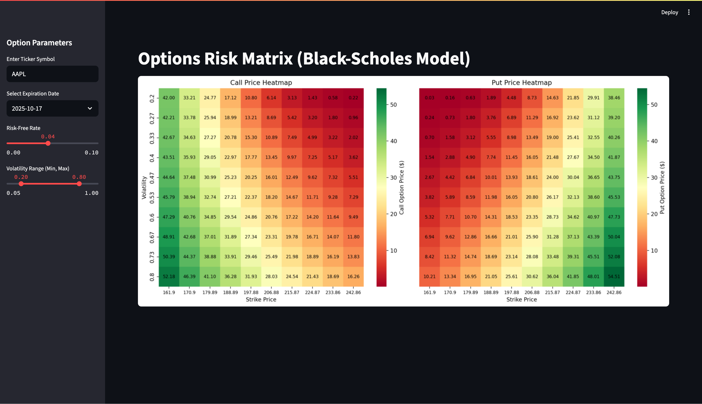

# Options Risk Analysis Tool

*Note: The live demo may take ~20 seconds to load if inactive (free-tier hosting). Thank you for your patience!


This project is an interactive web app for visualizing option pricing matrices using the Black-Scholes model. Users can dynamically generate call and put option price heatmaps based on real-time data for any stock ticker.

Built as a data science portfolio project to demonstrate applied financial modeling, Python engineering, and front-end interactivity with Streamlit.

## Preview

[View the Live Demo on Streamlit Cloud](https://options-risk-analysis-jsdhgi4skbdrxyekao7cw6.streamlit.app/)

Below is an example screenshot from the Options Risk Analysis Tool web app:

### Call & Put Matrix Heatmaps


## Features

- Real-time data fetching via Yahoo Finance API
- Black-Scholes modeling of call and put prices
- 10x10 price heatmaps based on strike price and volatility
- Ticker input with autocomplete suggestions
- Custom selection of expiration date, risk-free rate, and volatility range
- Streamlit interface with side panel controls
- Dynamic color mapping from red (low value) to green (high value)

## Tech Stack

- Python
- Streamlit
- yfinance
- NumPy
- Pandas
- Seaborn
- Matplotlib
- SciPy

## Installation

1. Clone the repository:

   ```bash
   git clone https://github.com/yourusername/options-risk-analysis.git
   cd options-risk-analysis
   ```

2. (Optional but recommended) Create and activate a virtual environment:

   ```bash
   python -m venv venv
   source venv/bin/activate  # Windows: venv\Scripts\activate
   ```

3. Install the dependencies:

   ```bash
   pip install -r requirements.txt
   ```

## Running the App

To launch the app in your browser:

```bash
streamlit run app.py
```

## Testing

To run unit tests:

```bash
python tests.py
```

## Insights

This project was inspired by the visual matrix-style options tools used by professional analysts. I wanted to create a lightweight version that helps traders and learners intuitively understand how strike prices and volatility affect options valuation.

One challenge was ensuring that the heatmaps remained interpretable while offering enough parameter flexibility to simulate different market scenarios. I also prioritized performance and usability, including real-time ticker handling and a clean UI.

This tool is meant for educational and analytical purposes. It could be expanded in the future to include historical implied volatility, Greeks, profit/loss zones, and machine learning forecasts.

## License

This project is licensed under the MIT License.

## Author

Developed by Cal Teeling as part of a financial data science portfolio.
